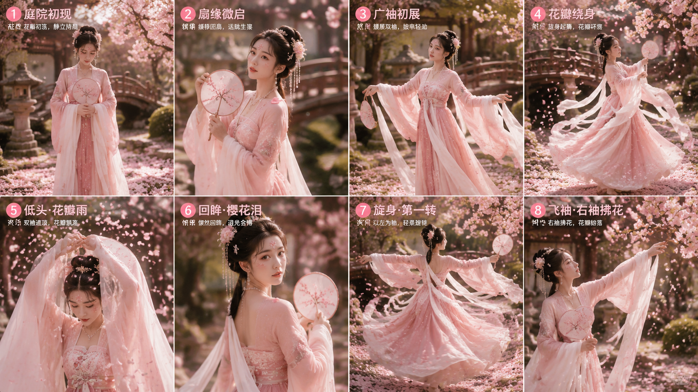
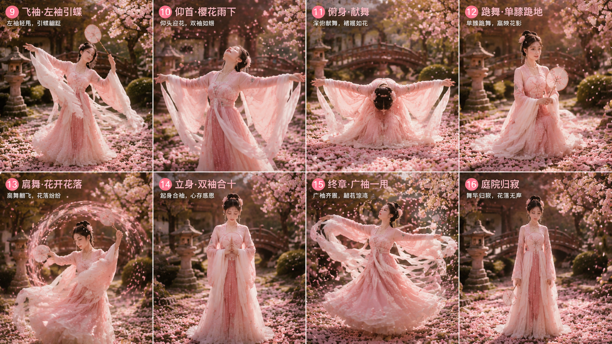

# AI提示词工厂 · AI Prompt Factory

> AI视频提示词方法论 + 可直接用的分镜/故事板模板包
> 已验证的真实生成效果，拒绝理论空谈

---

## 📦 项目简介

这是一个经过**实战验证**的AI提示词方法论与模板集合。

项目中的所有方法论都经过**真实生成验证**（已成功生成16宫格分镜图、10秒/15秒视频提示词），不是纯理论堆砌。

### 适用人群

- 🎥 AI视频创作者（Seedance / Grok / HappyHorse / 即梦AI用户）
- 📝 短视频编剧（需要快速度的产品视频/广告/舞蹈分镜）
- 🎨 AI绘画玩家（需要高质量的分镜图提示词）
- 💼 品牌营销人员（需要标准化的产品视频脚本）

---

## 🎨 效果展示

> 以下为各案例提示词的真实生成效果

### 大唐樱花独舞·上下篇16宫格分镜




### 🧠 核心方法论

### ① 六维定位法 —— 分镜图提示词

专门用于AI生成高质量的多宫格分镜图。

```
[整体定位] + [场景设定] + [人物设定] + [服装妆造] + [版式要求] + [动作序列]
```

**已验证效果**：成功生成大唐舞蹈、国风分镜、产品流程等16宫格分镜图。

### ② 四要素公式 —— 电影级分镜描述

专门用于AI视频生成的镜头级分镜描述。

```
[时间戳] + 【特效命名】 + [镜头运动+速度+效果] + [主体动作+环境+情绪]
```

**已验证效果**：成功生成14秒未来战甲视频分镜。

### ③ 三栏故事板模板 —— 专业前期策划

专门用于生成影视级故事板设定图。

```
左侧：角色设定 + 中间：场景设计 + 右侧：分镜板（6-8个镜头）
底部：光影/情绪/音效/道具信息
```

**已验证效果**：成功生成护肤品故事板。

### ④ 产品视频2*4+4公式 —— 15秒品牌广告

```
2秒环境建立 + 4秒问题展示 + 4秒产品演示 + 4秒使用效果 + 1秒品牌露出
```

### ⑤ 6段式电影级分镜框架 —— 科幻/奇幻动作序列

专门用于生成史诗级动作长镜头，从镜头进入→场景穿越→危机爆发→逃生收尾。

```
段1：镜头视角 → 段2：场景设定 → 段3：主体运动
→ 段4：触发事件 → 段5：剧情高潮 → 段6：收尾氛围
```

**内置三套可直接使用的实例**：蒸汽朋克·机械蜂鸟 / 暗黑奇幻·元素精灵 / 赛博朋克·赛博骑士

---

## 🎬 实战案例包（共6套）

| # | 案例 | 类型 | 适用工具 | 已验证 |
|:---:|:---|:---|:---|:---:|
| 01 | 🏮 大唐樱花独舞·上下篇 | 国风舞蹈·16宫格+2×10s视频 | Seedance/Grok | ✅ |
| 02 | 🦋 金晨·白衣青花瓷·国风独舞 | 国风舞蹈·16宫格+15s视频 | Seedance/Grok | ✅ |
| 03 | 👑 大唐独舞·豪华宫殿版 | 宫廷舞蹈·16宫格 | 文生图 | ✅ |
| 04 | 🐉 敦煌反弹琵琶舞 | 敦煌舞蹈·16宫格 | 文生图 | ✅ |
| 05 | 🤖 未来战甲·第58集 | 科幻动作·14s视频9段 | Grok | ✅ |
| 06 | 🧴 蒽菲骨胶原皴裂膏 | 产品广告·15s三件套 | 皆可 | ✅ |

> 每个案例均包含：**分镜图提示词 + Seedance 2.0提示词 + Grok 3提示词**（部分含Stable Diffusion/Kling）

---

## 🛠️ 模板工具

| 文件 | 用途 |
|:---|:---|
| `templates/故事板提示词模板.md` | 专业三栏故事板生成模板 |
| `templates/产品视频15秒模板.md` | 品牌产品视频快捷模板 |
| `templates/6段式电影级分镜框架.md` | 科幻/奇幻动作序列（含3套实例） |

### 项目文件树

```
prompt-factory/
├── README.md
├── LICENSE
├── cases/
│   ├── 01_大唐樱花独舞_上下篇.txt        ← 16宫格+2×10s视频
│   ├── 02_金晨_白衣青花瓷_三件套.txt      ← 16宫格+15s视频
│   ├── 03_蒽菲骨胶原皴裂膏_15秒产品剧本.txt ← 产品广告
│   ├── 04_蒽菲骨胶原皴裂膏_故事板提示词.txt  ← 故事板
│   ├── 05_提示词深度学习总结包.md         ← 6大方法论文档
│   └── 06_6段式电影级分镜框架.md         ← 蒸汽/暗黑/赛博实例
└── templates/
    ├── 故事板提示词模板.md
    └── 产品视频15秒模板.md
```

---

## 🚀 快速开始

```bash
# 克隆仓库
git clone https://github.com/你的用户名/prompt-factory.git

# 选择一个案例，复制对应的提示词
cd cases/

# 粘贴到你的AI工具（Seedance/Grok/即梦AI）使用
```

---

## 🤝 赞助

如果这个项目对你有帮助，欢迎请我喝咖啡 ☕

> ⚠️ GitHub Sponsors 暂不支持中国大陆银行卡，以下为直接赞赏方式

| 微信赞赏码 | 支付宝赞赏码 |
|:---:|:---:|
|  |  |

> *📌 将你的收款码图片命名为 `wechat_qr.png` 和 `alipay_qr.png` 放入 `assets/` 目录即可*

---

## 📄 许可

MIT License — 自由使用，欢迎共建
